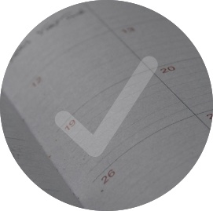

  

  

<h1 align="center">Everything Cal</h1>

## Description
Everything Cal is a daily planner that allows the user to save their todos, goals or notes for a specific hour of the day. This planner will visually show the user the hours of the day that are now behind them, the hour of the day at the time they are viewing the planner and then future hours (with gray, red and green color coding).

  ## Built With
  - JavaScript
  - HTML
  - CSS

  ## Website

<a href="file:///Users/nicolebarranca/Desktop/Rutgers%20Bootcamp/week-5/Everything-Cal/index.html">Everything Cal</a>

## Contribution
Made with ❤️ by Nicole Barranca

## Questions

Feel free to contact me directly at nikkibarranca@gmail.com if you have any questions about the repo. 

You can find more of my work at [Nicole Barranca](https://github.com/NicoleBarranca).